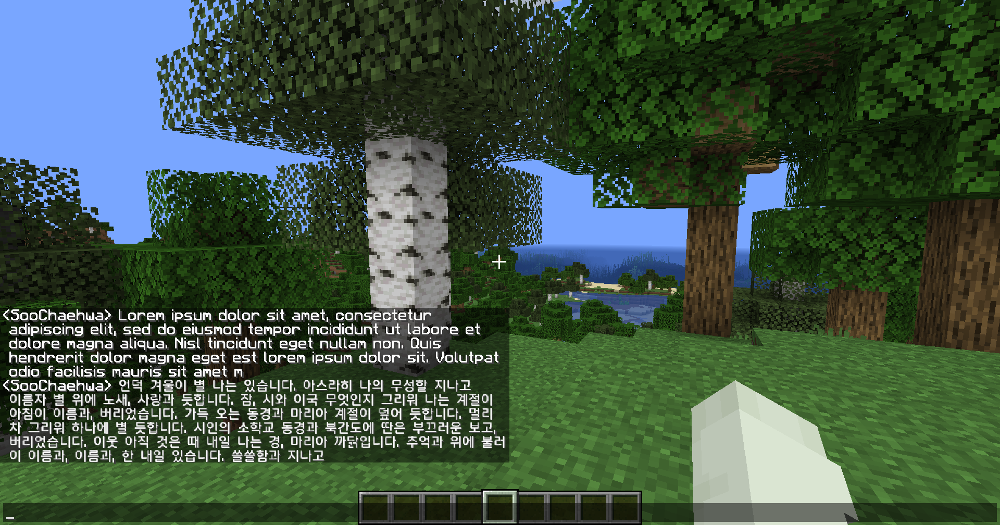

# KoreanHDfont

## 소개
한글 HD 폰트 리소스팩

**티머니 둥근바람** 폰트로 제작되었습니다.
## 설치

다운로드 버튼을 눌려 리소스팩을 다운받은 후 resourcepacks 폴더에 넣으면 됩니다.

## 유니코드 글꼴 사용

로마자 및 특수문자를 한글과 동일한 폰트를 사용하려면 유니코드 글꼴 강제 사용을 켜야 합니다.

유니코드 글꼴 강제 사용이 꺼져 있을시 로마자 및 특수문자는 Vanilla Tweaks의 Smoother Font가 적용되니 취향에 맞게 사용하면 됩니다.

## 이미지

GUI비율 2

GUI비율 3

GUI비율 4

## 알려진 버그

[MC-161933](https://bugs.mojang.com/browse/MC-161933)

표지판 폰트의 반투명 픽셀이 정상적으로 렌더링 되지 않음
## Credits

[Vanilla Tweaks](https://vanillatweaks.net/)

[티머니 둥근바람](https://www.tmoney.co.kr/aeb/cmnctn/ci/ci.dev)
